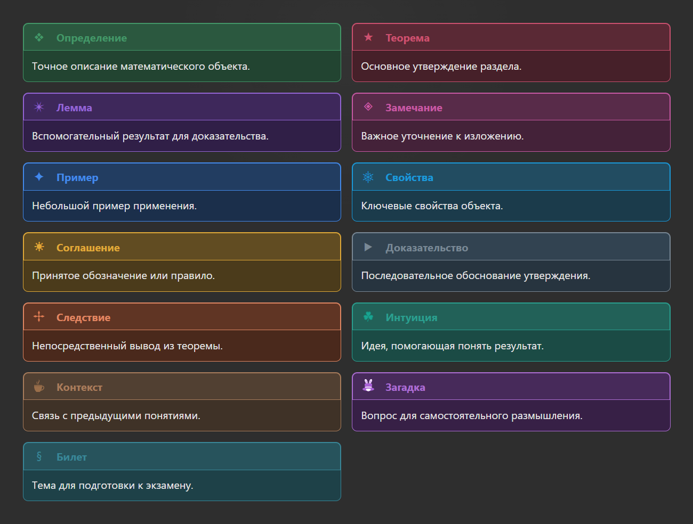

# Math Pages Palette

Плагин для выразительных и хорошо организованных математических конспектов. Он добавляет академические блоки Pages с проработанными иконками, цветами и визуальной иерархией.

## Использование

Откройте контекстное меню редактора:

**Пкм** $\rightarrow$ **Палитра** $\rightarrow$ **Академический блок**

Затем выберите нужный тип. Если заранее выделить текст, плагин сразу поместит его внутрь нового блока.

Блок также можно вставить через команду **«Вставить академический блок»**.

## Доступные блоки

## Совместимость

Блоки сохраняются в стандартном формате Obsidian. Плагин также совместим с Cluddle Callouts.
