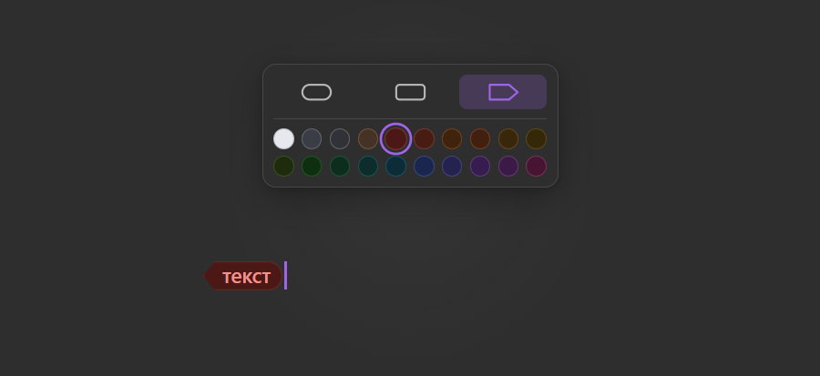

# Prism Adaptive Tags

Плагин добавляет компактные цветные теги для дат, статусов и смысловых акцентов. Палитра мягко адаптируется к светлой и тёмной темам Prism, сохраняя единый стиль заметки.

## Использование

Откройте контекстное меню редактора:

- **Пкм** $\rightarrow$ **Палитра** $\rightarrow$ **Цветной тег**
- **Пкм** $\rightarrow$ **Палитра** $\rightarrow$ **Тег-стрелка**

Если текст выделен, плагин сразу оформит его. Без выделения будет вставлена заготовка с выбранным текстом.

## Быстрая смена оформления



Поставьте курсор внутрь тега и выберите цвет или форму.

## Короткий синтаксис

Обычный тег:

```markdown
((gray|Пример тега))
```

Тег-стрелка:

```markdown
((<graphite|Из собственной палитры))
```

Тег-плашка:

```markdown
((~blue|Важная дата))
```

Можно использовать английские или русские названия цветов:

```markdown
((blue|Лекция))
((красный|Срочно))
```

## Палитра

Нейтральные: `white`, `gray`, `graphite`.

Тёплые: `brown`, `red`, `coral`, `orange`, `peach`, `gold`, `yellow`.

Зелёные и бирюзовые: `lime`, `green`, `mint`, `teal`, `cyan`.

Холодные и фиолетовые: `blue`, `indigo`, `purple`, `lavender`, `pink`.

## Совместимость

Плагин самостоятельно отображает теги в Live Preview и режиме чтения. `Tags for Markdown` не требуется.

Вместе с Math Pages Palette он создаёт единое контекстное меню **«Палитра»**.
